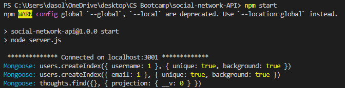

# social-network-API

BootCamp Challenge - 18 NoSQL Challenge: Social Network API

## Description

To create a database without using SQL to find users and thoughts on social network.

## The look

## Issues

I wasn't able to get it to show up on insomina. However, whenever I connected, I was able to see Mongoose connect in my terminal. If I get the chance to work on it more, I am excited to find out the problem and be in relief to have problem solved my code.

[WalkthroughVideo](https://drive.google.com/file/d/1I_pzgVQpkCbGdKFKmNVs2O6L6XKYF8MS/view)

## Installation

Project is upload to [Github](https://github.com/) at the following [respository.](https://github.com/mysteriousdj/social-network-API)
